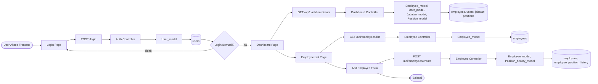

# CRUD Data Karyawan
## 🔄 Flowchart Proses CRUD Data Karyawan

Flowchart berikut menggambarkan alur proses utama aplikasi dari frontend, backend, hingga database:



Aplikasi CRUD Data Karyawan menggunakan CodeIgniter 3, Microsoft SQL Server, dan Gentelella Admin Template, berjalan di Docker.

---


## 🏗 Docker Architecture

```
┌─────────────────────────────────────────────┐
│              Docker Network                  │
│           (karyawan_network)                 │
│                                              │
│  ┌──────────────┐     ┌──────────────────┐  │
│  │   web        │     │   database       │  │
│  │ PHP 8.2      │────▶│ SQL Server 2022  │  │
│  │ + Apache     │     │                  │  │
│  │ + sqlsrv     │     │ Port: 1433       │  │
│  │ Port: 8080   │     │                  │  │
│  └──────────────┘     └──────────────────┘  │
└─────────────────────────────────────────────┘
```

---

## 🖥️ End-to-End Architecture (Frontend–Backend–Database)

### Overview

```mermaid
flowchart TD
   subgraph Frontend (Browser)
      A1[Login Page]
      A2[Dashboard Page]
      A3[Employee List]
      A4[Employee Form]
      A5[Position List]
      A6[Jabatan List]
      A7[History Page]
      A1 -- POST /login --> B1
      A2 -- GET /api/dashboard/stats --> B2
      A3 -- GET /api/employees/list --> B3
      A4 -- POST /api/employees/create|update|delete --> B4
      A5 -- GET /api/positions/list --> B5
      A6 -- GET /api/jabatan/list --> B6
      A7 -- GET /api/employees/{id}/history --> B7
   end
   subgraph Backend (PHP/CodeIgniter)
      B1[Auth Controller]
      B2[Dashboard Controller]
      B3[Employee Controller]
      B4[Employee Controller]
      B5[Position Controller]
      B6[Jabatan Controller]
      B7[Employee Controller]
      B1 -- Query User_model --> C1
      B2 -- Query Employee_model, User_model, Jabatan_model, Position_model --> C2
      B3 -- Query Employee_model --> C3
      B4 -- Update Employee_model, Position_history_model --> C4
      B5 -- Query Position_model --> C5
      B6 -- Query Jabatan_model --> C6
      B7 -- Query Position_history_model --> C7
   end
   subgraph Database (SQL Server)
      C1[(users)]
      C2[(employees, users, jabatan, positions)]
      C3[(employees)]
      C4[(employees, employee_position_history, positions)]
      C5[(positions)]
      C6[(jabatan)]
      C7[(employee_position_history)]
   end
```

### Penjelasan Alur

- **Frontend**: Komponen utama (login, dashboard, list, form, history) melakukan request AJAX (GET/POST) ke endpoint backend.
- **Backend**: Controller menerima request, memproses validasi, otorisasi, dan business logic, lalu berinteraksi dengan model.
- **Model**: Model melakukan query ke database (SQL Server) untuk mengambil, menambah, mengubah, atau menghapus data.
- **Database**: Tabel utama: `users`, `employees`, `jabatan`, `positions`, `employee_position_history`.

Contoh alur:
- User login → POST `/login` → Auth Controller → User_model → `users`
- Lihat data karyawan → GET `/api/employees/list` → Employee Controller → Employee_model → `employees`
- Tambah karyawan → POST `/api/employees/create` → Employee Controller → Employee_model/Position_history_model → `employees`, `employee_position_history`

---

| Service  | Image                                    | Port | Description                     |
|----------|------------------------------------------|------|---------------------------------|
| web      | PHP 8.2 Apache (custom Dockerfile)       | 8080 | CodeIgniter 3 application       |
| database | mcr.microsoft.com/mssql/server:2022-latest | 1433 | Microsoft SQL Server 2022       |

### Environments

| File                   | Type        | Description                                |
|------------------------|-------------|--------------------------------------------|
| `docker-compose.yml`   | Production  | No volume mounts, optimized runtime        |
| `docker-compose.dev.yml` | Development | Source code mounted, hot reload enabled   |

---

## 🗄 Database Schema

### Tables

**employees** — Main employee data

| Column | Type | Constraints |
|--------|------|-------------|
| id | INT IDENTITY | PRIMARY KEY |
| nip | VARCHAR(20) | NOT NULL, UNIQUE |
| nama | VARCHAR(100) | NOT NULL |
| jenis_kelamin | VARCHAR(20) | NOT NULL |
| jabatan | VARCHAR(100) | NOT NULL |
| tanggal_aktif_jabatan | DATE | NOT NULL |
| tanggal_masuk | DATE | NOT NULL |
| status_karyawan | VARCHAR(20) | NOT NULL |
| is_active | VARCHAR(10) | DEFAULT 'active' |

**users** — Authentication

| Column | Type | Constraints |
|--------|------|-------------|
| id | INT IDENTITY | PRIMARY KEY |
| username | VARCHAR(50) | NOT NULL, UNIQUE |
| password | VARCHAR(255) | NOT NULL (hashed) |
| role | VARCHAR(20) | NOT NULL |
| is_active | VARCHAR(10) | DEFAULT 'active' |

**jabatan** — Job position categories

| Column | Type | Constraints |
|--------|------|-------------|
| id | INT IDENTITY | PRIMARY KEY |
| nama_jabatan | VARCHAR(100) | NOT NULL, UNIQUE |
| deskripsi | VARCHAR(255) | NULL |
| is_active | VARCHAR(10) | DEFAULT 'active' |

**positions** — Normalized position reference (for history tracking)

| Column | Type | Constraints |
|--------|------|-------------|
| id | INT IDENTITY | PRIMARY KEY |
| name | VARCHAR(100) | NOT NULL |
| created_at | DATETIME | DEFAULT GETDATE() |
| updated_at | DATETIME | DEFAULT GETDATE() |

**employee_position_history** — Position change log

| Column | Type | Constraints |
|--------|------|-------------|
| id | INT IDENTITY | PRIMARY KEY |
| employee_id | INT | NOT NULL, FK → employees(id) |
| position_id | INT | NOT NULL, FK → positions(id) |
| start_date | DATE | NOT NULL |
| end_date | DATE | NULL |
| created_at | DATETIME | DEFAULT GETDATE() |

---

## 📊 Job Position History Architecture

### How It Works

```
Employee Created → Initial position history record inserted (end_date = NULL)
                                    ↓
Admin Changes Position → Previous record closed (end_date = today)
                       → New record created (end_date = NULL)
                                    ↓
Current Position = Record where end_date IS NULL
```

### Position Change Logic

When an administrator updates an employee's position:

1. **Close previous record:**
   ```sql
   UPDATE employee_position_history
   SET end_date = CURRENT_DATE
   WHERE employee_id = ? AND end_date IS NULL
   ```

2. **Create new record:**
   ```sql
   INSERT INTO employee_position_history
   (employee_id, position_id, start_date, end_date)
   VALUES (?, ?, ?, NULL)
   ```

### Data Rules

- Each employee may have multiple position history records
- First position is automatically logged when employee is created
- The **latest/current position** is the record where `end_date IS NULL`
- Position changes are tracked automatically — no manual history entry needed

---

## 👥 User Roles & Dashboard Differentiation

### Admin Dashboard

| Widget | Description |
|--------|-------------|
| Karyawan Aktif | Count of active employees |
| Laki-laki | Male employee count |
| Perempuan | Female employee count |
| Permanen | Permanent employee count |
| Kontrak | Contract employee count |
| Total Jabatan | Total positions count |
| Perubahan Jabatan Terbaru | Latest 5 position changes |
| Quick Links | Positions, History pages |

### User Dashboard

| Widget | Description |
|--------|-------------|
| Karyawan Aktif | Count of active employees |
| Laki-laki | Male employee count |
| Perempuan | Female employee count |
| Permanen | Permanent employee count |
| Kontrak | Contract employee count |

User dashboard does **NOT** contain: Total Jabatan, position management widgets, latest changes table, or position/history quick links.

### Permissions

| Action | Administrator | User |
|--------|:---:|:---:|
| View employees | ✅ | ✅ |
| Add/Edit/Delete employees | ✅ | ❌ |
| View position history | ✅ | ✅ |
| Change positions | ✅ | ❌ |
| Manage positions | ✅ | ❌ |

---

## 🌐 API Endpoints


### Authentication

#### POST `/login`
- **Request (application/x-www-form-urlencoded):**
   - `username` (string, required)
   - `password` (string, required)
- **Response:**
   - Sukses:
      ```json
      { "status": true, "message": "Login berhasil!", "redirect": "http://localhost:8080/dashboard" }
      ```
   - Gagal:
      ```json
      { "status": false, "message": "Username atau password salah." }
      ```

#### GET `/logout`
- **Response:** Redirect ke halaman login, session dihapus.

---

### Dashboard

| Method | Endpoint | Description |
|--------|----------|-------------|
| GET | `/dashboard` | Dashboard page |
| GET | `/api/dashboard/stats` | Statistics (admin gets extra data) |

---

### Employee CRUD

#### GET `/api/employees/list`
- **Query Params:**
   - `limit` (int, optional, default: 10)
   - `offset` (int, optional, default: 0)
   - `search` (string, optional)
   - `sort_by` (string, optional, default: "id")
   - `sort_dir` (string, optional, default: "ASC")
- **Response:**
   ```json
   {
      "status": true,
      "data": [ { ...employee }, ... ],
      "total": 100,
      "limit": 10,
      "offset": 0
   }
   ```

#### GET `/api/employees/get/{id}`
- **Response:**
   - Sukses:
      ```json
      { "status": true, "data": { ...employee } }
      ```
   - Gagal:
      ```json
      { "status": false, "message": "Karyawan tidak ditemukan." }
      ```

#### POST `/api/employees/create`
- **Request (application/x-www-form-urlencoded):**
   - `nip`, `nama`, `jenis_kelamin`, `jabatan`, `tanggal_aktif_jabatan`, `tanggal_masuk`, `status_karyawan`, `is_active`
- **Response:**
   - Sukses:
      ```json
      { "status": true, "message": "Karyawan berhasil ditambahkan.", "id": 1 }
      ```
   - Gagal validasi:
      ```json
      { "status": false, "message": "Validasi gagal.", "errors": { "nip": "NIP wajib diisi" } }
      ```
   - NIP sudah digunakan:
      ```json
      { "status": false, "message": "NIP sudah digunakan." }
      ```

#### POST `/api/employees/update/{id}`
- **Request:** Sama seperti create.
- **Response:** Mirip dengan create, dengan pesan `"Karyawan berhasil diperbarui."`

#### POST `/api/employees/delete/{id}`
- **Response:**
   - Sukses:
      ```json
      { "status": true, "message": "Karyawan berhasil dihapus." }
      ```
   - Gagal:
      ```json
      { "status": false, "message": "Gagal menghapus karyawan." }
      ```

#### GET `/api/employees/{id}/history`
- **Response:**
   ```json
   {
      "status": true,
      "data": {
         "employee": { ...employee },
         "history": [ { ...position_history }, ... ]
      }
   }
   ```

---

### Jabatan & Position CRUD

Struktur request/response untuk jabatan dan position mirip dengan employee, dengan field yang sesuai (`nama_jabatan`, `deskripsi`, `is_active` untuk jabatan; `name` untuk position).

---

## 📄 Frontend Pages

### History Page Usage

1. Navigate to **Riwayat Jabatan** in sidebar
2. Select an employee from the dropdown
3. View complete position timeline (newest first)
4. Current position highlighted in green with "Current Position" badge

### History from Employee List

1. Go to **Data Karyawan**
2. Click the **history button** (clock icon) on any row
3. Modal opens showing position timeline
4. Click "Lihat Halaman Penuh" to go to dedicated history page

---

## 📊 Dummy Data

### Positions (10 records)

Manager IT, Staff Keuangan, Staff HRD, Staff Marketing, Staff Administrasi, Supervisor HR, Asisten Manager Keuangan, Sekretaris, Manager Produksi, Admin Produksi

### Employees (5 records)

| NIP | Nama | Jabatan | Status |
|-----|------|---------|--------|
| NIP001 | Lukman Hakim | Manager IT | Tetap |
| NIP002 | Saiful Anwar | Staff Keuangan | Tetap |
| NIP003 | Sinta Mei | Staff HRD | Kontrak |
| NIP004 | Tubagus | Staff Marketing | Tetap |
| NIP005 | Nana M | Staff Administrasi | Kontrak |

### Users

| Username | Password | Role |
|----------|----------|------|
| admin | admin123 | administrator |
| user | user123 | user |

---

## 🚀 Quick Start

### Production

```bash
docker-compose up -d
```

### Development

```bash
docker-compose -f docker-compose.dev.yml up -d
```

### Access

- **Application**: http://localhost:8080
- **Login**: admin / admin123

### Stop & Reset

```bash
docker-compose down       # Stop
docker-compose down -v    # Stop + reset database
docker-compose up -d      # Start fresh
```

---

## 📁 Project Structure

```
├── docker/
│   ├── Dockerfile
│   ├── init-db.php             # DB init + positions + history seed
│   └── start.sh
├── application/
│   ├── config/
│   │   ├── autoload.php
│   │   ├── config.php
│   │   ├── database.php        # sqlsrv driver
│   │   └── routes.php          # All routes incl. positions & history
│   ├── controllers/
│   │   ├── Auth.php
│   │   ├── Dashboard.php       # Admin/User differentiated
│   │   ├── Employee.php        # CRUD + history API + position tracking
│   │   ├── Jabatan.php
│   │   └── Position.php        # Position CRUD
│   ├── models/
│   │   ├── Employee_model.php  # Gender stats, simple list
│   │   ├── User_model.php
│   │   ├── Jabatan_model.php
│   │   ├── Position_model.php
│   │   └── Position_history_model.php
│   └── views/
│       ├── layout/
│       │   ├── header.php      # Sidebar with Posisi & Riwayat menus
│       │   └── footer.php
│       ├── auth/login.php
│       ├── dashboard/index.php # Admin vs User dashboard
│       ├── employee/
│       │   ├── list.php        # History modal button
│       │   ├── form.php        # Position dropdown
│       │   └── history.php     # History timeline page
│       ├── jabatan/
│       │   ├── list.php
│       │   └── form.php
│       └── positions/
│           ├── list.php        # Position management
│           └── form.php
├── assets/
│   ├── css/
│   └── js/
├── docker-compose.yml
├── docker-compose.dev.yml
└── README.md
```
